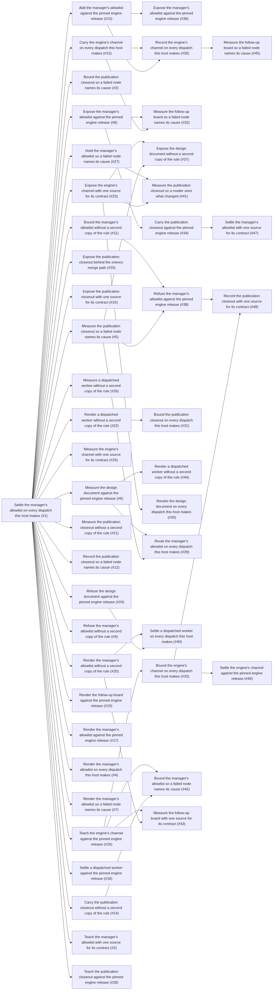

## Planned tasks

| Task | Unit | What it delivers | Depends on | Where it lives |
| --- | --- | --- | --- | --- |
| Settle the manager's allowlist on every dispatch this host makes (#1) | unit-1 | What task 1 delivers, in a sentence | none | github.com/nickderobertis/ai-orchestrator |
| Teach the manager's allowlist with one source for its contract (#2) | unit-2 | What task 2 delivers, in a sentence | Settle the manager's allowlist on every dispatch this host makes (#1) | github.com/nickderobertis/ai-orchestrator |
| Bound the publication closeout so a failed node names its cause (#3) | unit-3 | What task 3 delivers, in a sentence | Settle the manager's allowlist on every dispatch this host makes (#1) | github.com/nickderobertis/ai-orchestrator |
| Render the manager's allowlist on every dispatch this host makes (#4) | unit-4 | What task 4 delivers, in a sentence | Settle the manager's allowlist on every dispatch this host makes (#1) | github.com/nickderobertis/ai-orchestrator |
| Measure the publication closeout so a failed node names its cause (#5) | unit-1 | What task 5 delivers, in a sentence | Settle the manager's allowlist on every dispatch this host makes (#1) | github.com/nickderobertis/ai-orchestrator |
| Measure the design document against the pinned engine release (#6) | unit-2 | What task 6 delivers, in a sentence | Settle the manager's allowlist on every dispatch this host makes (#1) | github.com/nickderobertis/ai-orchestrator |
| Render the manager's allowlist so a failed node names its cause (#7) | unit-3 | What task 7 delivers, in a sentence | Settle the manager's allowlist on every dispatch this host makes (#1) | github.com/nickderobertis/ai-orchestrator |
| Expose the manager's allowlist against the pinned engine release (#8) | unit-4 | What task 8 delivers, in a sentence | Settle the manager's allowlist on every dispatch this host makes (#1) | github.com/nickderobertis/ai-orchestrator |
| Refuse the manager's allowlist without a second copy of the rule (#9) | unit-1 | What task 9 delivers, in a sentence | Settle the manager's allowlist on every dispatch this host makes (#1) | github.com/nickderobertis/ai-orchestrator |
| Expose the publication closeout with one source for its contract (#10) | unit-2 | What task 10 delivers, in a sentence | Settle the manager's allowlist on every dispatch this host makes (#1) | github.com/nickderobertis/ai-orchestrator |
| Bound the manager's allowlist without a second copy of the rule (#11) | unit-3 | What task 11 delivers, in a sentence | Settle the manager's allowlist on every dispatch this host makes (#1) | github.com/nickderobertis/ai-orchestrator |
| Record the publication closeout so a failed node names its cause (#12) | unit-4 | What task 12 delivers, in a sentence | Settle the manager's allowlist on every dispatch this host makes (#1) | github.com/nickderobertis/ai-orchestrator |
| Add the manager's allowlist against the pinned engine release (#13) | unit-1 | What task 13 delivers, in a sentence | Settle the manager's allowlist on every dispatch this host makes (#1) | github.com/nickderobertis/ai-orchestrator |
| Carry the publication closeout without a second copy of the rule (#14) | unit-2 | What task 14 delivers, in a sentence | Settle the manager's allowlist on every dispatch this host makes (#1) | github.com/nickderobertis/ai-orchestrator |
| Carry the engine's channel on every dispatch this host makes (#15) | unit-3 | What task 15 delivers, in a sentence | Settle the manager's allowlist on every dispatch this host makes (#1) | github.com/nickderobertis/ai-orchestrator |
| Teach the engine's channel against the pinned engine release (#16) | unit-4 | What task 16 delivers, in a sentence | Settle the manager's allowlist on every dispatch this host makes (#1) | github.com/nickderobertis/ai-orchestrator |
| Render the manager's allowlist against the pinned engine release (#17) | unit-1 | What task 17 delivers, in a sentence | Settle the manager's allowlist on every dispatch this host makes (#1) | github.com/nickderobertis/ai-orchestrator |
| Settle a dispatched worker against the pinned engine release (#18) | unit-2 | What task 18 delivers, in a sentence | Settle the manager's allowlist on every dispatch this host makes (#1) | github.com/nickderobertis/ai-orchestrator |
| Render the follow-up board against the pinned engine release (#19) | unit-3 | What task 19 delivers, in a sentence | Settle the manager's allowlist on every dispatch this host makes (#1) | github.com/nickderobertis/ai-orchestrator |
| Render the manager's allowlist without a second copy of the rule (#20) | unit-4 | What task 20 delivers, in a sentence | Settle the manager's allowlist on every dispatch this host makes (#1) | github.com/nickderobertis/ai-orchestrator |
| Measure the publication closeout without a second copy of the rule (#21) | unit-1 | What task 21 delivers, in a sentence | Settle the manager's allowlist on every dispatch this host makes (#1) | github.com/nickderobertis/ai-orchestrator |
| Render a dispatched worker without a second copy of the rule (#22) | unit-2 | What task 22 delivers, in a sentence | Settle the manager's allowlist on every dispatch this host makes (#1) | github.com/nickderobertis/ai-orchestrator |
| Expose the engine's channel with one source for its contract (#23) | unit-3 | What task 23 delivers, in a sentence | Settle the manager's allowlist on every dispatch this host makes (#1) | github.com/nickderobertis/ai-orchestrator |
| Refuse the design document against the pinned engine release (#24) | unit-4 | What task 24 delivers, in a sentence | Settle the manager's allowlist on every dispatch this host makes (#1) | github.com/nickderobertis/ai-orchestrator |
| Expose the publication closeout behind the onevcs merge path (#25) | unit-1 | What task 25 delivers, in a sentence | Settle the manager's allowlist on every dispatch this host makes (#1) | github.com/nickderobertis/ai-orchestrator |
| Measure a dispatched worker without a second copy of the rule (#26) | unit-2 | What task 26 delivers, in a sentence | Settle the manager's allowlist on every dispatch this host makes (#1) | github.com/nickderobertis/ai-orchestrator |
| Hold the manager's allowlist so a failed node names its cause (#27) | unit-3 | What task 27 delivers, in a sentence | Settle the manager's allowlist on every dispatch this host makes (#1) | github.com/nickderobertis/ai-orchestrator |
| Teach the publication closeout against the pinned engine release (#28) | unit-4 | What task 28 delivers, in a sentence | Settle the manager's allowlist on every dispatch this host makes (#1) | github.com/nickderobertis/ai-orchestrator |
| Measure the engine's channel with one source for its contract (#29) | unit-1 | What task 29 delivers, in a sentence | Settle the manager's allowlist on every dispatch this host makes (#1) | github.com/nickderobertis/ai-orchestrator |
| Render the design document on every dispatch this host makes (#30) | unit-2 | What task 30 delivers, in a sentence | Expose the engine's channel with one source for its contract (#23) | github.com/nickderobertis/ai-orchestrator |
| Bound the publication closeout on every dispatch this host makes (#31) | unit-3 | What task 31 delivers, in a sentence | Render a dispatched worker without a second copy of the rule (#22) | github.com/nickderobertis/ai-orchestrator |
| Measure the follow-up board so a failed node names its cause (#32) | unit-4 | What task 32 delivers, in a sentence | Carry the engine's channel on every dispatch this host makes (#15), Expose the manager's allowlist against the pinned engine release (#8) | github.com/nickderobertis/ai-orchestrator |
| Bound the engine's channel on every dispatch this host makes (#33) | unit-1 | What task 33 delivers, in a sentence | Teach the engine's channel against the pinned engine release (#16) | github.com/nickderobertis/ai-orchestrator |
| Carry the publication closeout against the pinned engine release (#34) | unit-2 | What task 34 delivers, in a sentence | Expose the manager's allowlist against the pinned engine release (#8) | github.com/nickderobertis/ai-orchestrator |
| Record the engine's channel on every dispatch this host makes (#35) | unit-3 | What task 35 delivers, in a sentence | Add the manager's allowlist against the pinned engine release (#13), Carry the engine's channel on every dispatch this host makes (#15) | github.com/nickderobertis/ai-orchestrator |
| Expose the manager's allowlist against the pinned engine release (#36) | unit-4 | What task 36 delivers, in a sentence | Add the manager's allowlist against the pinned engine release (#13) | github.com/nickderobertis/ai-orchestrator |
| Expose the design document without a second copy of the rule (#37) | unit-1 | What task 37 delivers, in a sentence | Measure the publication closeout so a failed node names its cause (#5), Expose the engine's channel with one source for its contract (#23) | github.com/nickderobertis/ai-orchestrator |
| Refuse the manager's allowlist against the pinned engine release (#38) | unit-2 | What task 38 delivers, in a sentence | Measure the publication closeout so a failed node names its cause (#5), Bound the manager's allowlist without a second copy of the rule (#11) | github.com/nickderobertis/ai-orchestrator |
| Route the manager's allowlist on every dispatch this host makes (#39) | unit-3 | What task 39 delivers, in a sentence | Measure the publication closeout so a failed node names its cause (#5), Measure the design document against the pinned engine release (#6) | github.com/nickderobertis/ai-orchestrator |
| Settle a dispatched worker on every dispatch this host makes (#40) | unit-4 | What task 40 delivers, in a sentence | Refuse the design document against the pinned engine release (#24), Render the manager's allowlist without a second copy of the rule (#20) | github.com/nickderobertis/ai-orchestrator |
| Measure the publication closeout so a reader sees what changed (#41) | unit-1 | What task 41 delivers, in a sentence | Expose the engine's channel with one source for its contract (#23), Hold the manager's allowlist so a failed node names its cause (#27) | github.com/nickderobertis/ai-orchestrator |
| Bound the manager's allowlist so a failed node names its cause (#42) | unit-2 | What task 42 delivers, in a sentence | Carry the publication closeout without a second copy of the rule (#14), Teach the engine's channel against the pinned engine release (#16) | github.com/nickderobertis/ai-orchestrator |
| Measure the follow-up board with one source for its contract (#43) | unit-3 | What task 43 delivers, in a sentence | Render the manager's allowlist without a second copy of the rule (#20), Teach the engine's channel against the pinned engine release (#16) | github.com/nickderobertis/ai-orchestrator |
| Render a dispatched worker without a second copy of the rule (#44) | unit-4 | What task 44 delivers, in a sentence | Measure the design document against the pinned engine release (#6) | github.com/nickderobertis/ai-orchestrator |
| Measure the follow-up board so a failed node names its cause (#45) | unit-1 | What task 45 delivers, in a sentence | Record the engine's channel on every dispatch this host makes (#35) | github.com/nickderobertis/ai-orchestrator |
| Settle the engine's channel against the pinned engine release (#46) | unit-2 | What task 46 delivers, in a sentence | Bound the engine's channel on every dispatch this host makes (#33) | github.com/nickderobertis/ai-orchestrator |
| Settle the manager's allowlist with one source for its contract (#47) | unit-3 | What task 47 delivers, in a sentence | Carry the publication closeout against the pinned engine release (#34) | github.com/nickderobertis/ai-orchestrator |
| Record the publication closeout with one source for its contract (#48) | unit-4 | What task 48 delivers, in a sentence | Bound the engine's channel on every dispatch this host makes (#33), Refuse the manager's allowlist against the pinned engine release (#38) | github.com/nickderobertis/ai-orchestrator |
